# Plan de Correlatividades – Medicina UNSE

Esta tabla resume las correlatividades del plan de estudios según la reglamentación oficial (ver PDF adjunto). La columna **Prereqs** indica los códigos de asignaturas que deben estar **aprobadas o regularizadas** para **cursar** la materia.

| Código | Asignatura | Prerrequisitos |
|---|---|---|
| 1 | Anatomía Normal | — |
| 2 | Citología, Histología y Embriología | — |
| 3 | Bioquímica y Biología Molecular | — |
| 4 | Antropología Médica y Social | — |
| 5 | Salud Pública I | 1, 2, 3, 4, 5 |
| 6 | Fisiología y Biofísica | 1, 2, 3 |
| 7 | Microbiología | 1, 2, 3 |
| 8 | Genética Médica | 1, 2, 3 |
| 9 | Informática Médica | 1, 2, 3 |
| 10 | Inglés I | — |
| 11 | Metodologíadela Investigación I | 5 |
| 12 | Salud Pública I I | 4, 5 |
| 13 | Inmunología | 1, 2, 3 |
| 14 | Relación Médico | 4, 5 |
| 15 | Anatomía Patológica | 2, 3, 6, 7, 8, 13 |
| 16 | Semiología | 2, 3, 6, 7, 8, 13 |
| 17 | Diagnósticopor Imágenes | 2, 3, 6 |
| 18 | Farmacología General | 2, 3, 6, 7, 8, 13 |
| 19 | Inglés I I | — |
| 20 | Metodologíadela Investigación I I | 11 |
| 21 | Relación Médico | — |
| 22 | Bioética | — |
| 23 | Portugués I | 10 |
| 24 | Salud Pública I II | — |
| 25 | Clínica Médica I | 15, 16, 17 |
| 26 | Clínica Quirúrgica I | 15, 16, 17, 18 |
| 27 | Clínica Infectológica | 15, 16, 17, 18 |
| 28 | Clínica Dermatológica | 15, 16, 17, 18 |
| 29 | Clínica Oftalmológica | 15, 16, 17, 18 |
| 30 | Clínica ORL | 15, 16, 17, 18 |
| 31 | Clínica Neurológica | 15, 16, 17, 18 |
| 32 | Clínica Ginecológica | 15, 16, 17, 18 |
| 33 | Clínica Urológica | 15, 16, 17, 18 |
| 34 | Nutrición | 15, 16 |
| 35 | Farmacología Aplicada y Toxicología | 15, 16, 17, 18 |
| 36 | Inglés I II | 19 |
| 37 | Medicina Preventiva y Social | 24 |
| 38 | Portugués I I | 23 |
| 39 | Clínica Médica IITodaslas Asignaturasde | 3, 4 |
| 40 | Clínica Quirúrgica I I | — |
| 41 | Clínica Pediátrica | — |
| 42 | Emergentología | — |
| 43 | Clínica Obstétrica | 32 |
| 44 | Clínica Traumatológica y Ortopedia | 25, 26, 31 |
| 45 | Clínica Psiquiátrica | 25, 31 |
| 46 | Salud Mental Todaslas Asignaturasde | 4 |
| 47 | Medicina Legal | — |
| 48 | Metodologíadela Investigación Clínica y Bioestadística Aplicada | — |
| 49 | Geriatría y Gerontología | — |
| 50 | Administración y Gestiónde Serviciosde Salud | — |
| 51 | Relaciones Humanas | 37 |

## Diagrama de flujo (Mermaid)

Visualización de dependencias entre materias. Cada flecha va desde una materia **prerrequisito** hacia la materia que la requiere:

```mermaid
graph TD
  C1[AnatomíaNormal]
  C2[Citología, HistologíayEmbriología]
  C3[BioquímicayBiologíaMolecular]
  C4[AntropologíaMédicaySocial]
  C5[SaludPúblicaI]
  C6[FisiologíayBiofísica]
  C7[Microbiología]
  C8[GenéticaMédica]
  C9[InformáticaMédica]
  C10[InglésI]
  C11[MetodologíadelaInvestigaciónI]
  C12[SaludPúblicaII]
  C13[Inmunología]
  C14[RelaciónMédico]
  C15[AnatomíaPatológica]
  C16[Semiología]
  C17[DiagnósticoporImágenes]
  C18[FarmacologíaGeneral]
  C19[InglésII]
  C20[MetodologíadelaInvestigaciónII]
  C21[RelaciónMédico]
  C22[Bioética]
  C23[PortuguésI]
  C24[SaludPúblicaIII]
  C25[ClínicaMédicaI]
  C26[ClínicaQuirúrgicaI]
  C27[ClínicaInfectológica]
  C28[ClínicaDermatológica]
  C29[ClínicaOftalmológica]
  C30[ClínicaORL]
  C31[ClínicaNeurológica]
  C32[ClínicaGinecológica]
  C33[ClínicaUrológica]
  C34[Nutrición]
  C35[FarmacologíaAplicadayToxicología]
  C36[InglésIII]
  C37[MedicinaPreventivaySocial]
  C38[PortuguésII]
  C39[ClínicaMédicaIITodaslasAsignaturasde]
  C40[ClínicaQuirúrgicaII]
  C41[ClínicaPediátrica]
  C42[Emergentología]
  C43[ClínicaObstétrica]
  C44[ClínicaTraumatológicayOrtopedia]
  C45[ClínicaPsiquiátrica]
  C46[SaludMentalTodaslasAsignaturasde]
  C47[MedicinaLegal]
  C48[MetodologíadelaInvestigaciónClínicayBioestadísticaAplicada]
  C49[GeriatríayGerontología]
  C50[AdministraciónyGestióndeServiciosdeSalud]
  C51[RelacionesHumanas]
  C1 --> C5
  C2 --> C5
  C3 --> C5
  C4 --> C5
  C5 --> C5
  C1 --> C6
  C2 --> C6
  C3 --> C6
  C1 --> C7
  C2 --> C7
  C3 --> C7
  C1 --> C8
  C2 --> C8
  C3 --> C8
  C1 --> C9
  C2 --> C9
  C3 --> C9
  C5 --> C11
  C4 --> C12
  C5 --> C12
  C1 --> C13
  C2 --> C13
  C3 --> C13
  C4 --> C14
  C5 --> C14
  C2 --> C15
  C3 --> C15
  C6 --> C15
  C7 --> C15
  C8 --> C15
  C13 --> C15
  C2 --> C16
  C3 --> C16
  C6 --> C16
  C7 --> C16
  C8 --> C16
  C13 --> C16
  C2 --> C17
  C3 --> C17
  C6 --> C17
  C2 --> C18
  C3 --> C18
  C6 --> C18
  C7 --> C18
  C8 --> C18
  C13 --> C18
  C11 --> C20
  C10 --> C23
  C15 --> C25
  C16 --> C25
  C17 --> C25
  C15 --> C26
  C16 --> C26
  C17 --> C26
  C18 --> C26
  C15 --> C27
  C16 --> C27
  C17 --> C27
  C18 --> C27
  C15 --> C28
  C16 --> C28
  C17 --> C28
  C18 --> C28
  C15 --> C29
  C16 --> C29
  C17 --> C29
  C18 --> C29
  C15 --> C30
  C16 --> C30
  C17 --> C30
  C18 --> C30
  C15 --> C31
  C16 --> C31
  C17 --> C31
  C18 --> C31
  C15 --> C32
  C16 --> C32
  C17 --> C32
  C18 --> C32
  C15 --> C33
  C16 --> C33
  C17 --> C33
  C18 --> C33
  C15 --> C34
  C16 --> C34
  C15 --> C35
  C16 --> C35
  C17 --> C35
  C18 --> C35
  C19 --> C36
  C24 --> C37
  C23 --> C38
  C3 --> C39
  C4 --> C39
  C32 --> C43
  C25 --> C44
  C26 --> C44
  C31 --> C44
  C25 --> C45
  C31 --> C45
  C4 --> C46
  C37 --> C51
```

